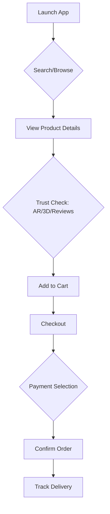
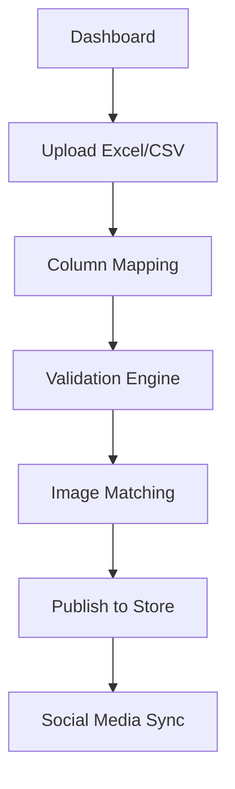
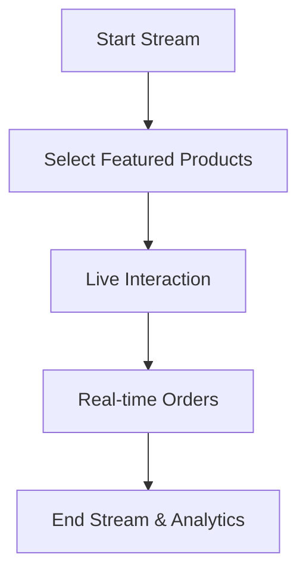
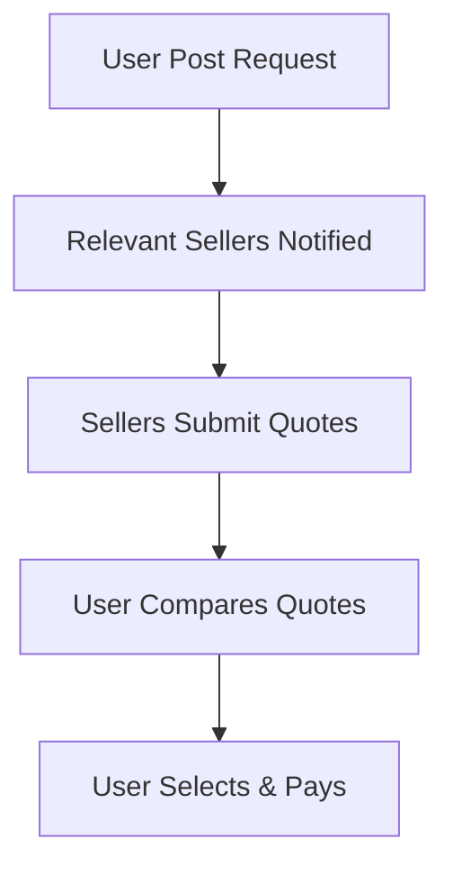

# User Flows

## 1. Consumer: Discovery to Purchase

```mermaid
graph TD
    A[Launch App] --> B{Search/Browse}
    B --> C[View Product Details]
    C --> D{Trust Check: AR/3D/Reviews}
    D --> E[Add to Cart]
    E --> F[Checkout]
    F --> G{Payment Selection}
    G --> H[Confirm Order]
    H --> I[Track Delivery]
```

## 2. Seller: Product Ingestion (Bulk)

```mermaid
graph TD
    A[Dashboard] --> B[Upload Excel/CSV]
    B --> C[Column Mapping]
    C --> D[Validation Engine]
    D --> E[Image Matching]
    E --> F[Publish to Store]
    F --> G[Social Media Sync]
```

## 3. Seller: Live Commerce Session

```mermaid
graph TD
    A[Start Stream] --> B[Select Featured Products]
    B --> C[Live Interaction]
    C --> D[Real-time Orders]
    D --> E[End Stream & Analytics]
```

## 4. On-Demand Product Request

```mermaid
graph TD
    A[User Post Request] --> B[Relevant Sellers Notified]
    B --> C[Sellers Submit Quotes]
    C --> D[User Compares Quotes]
    D --> E[User Selects & Pays]
```
