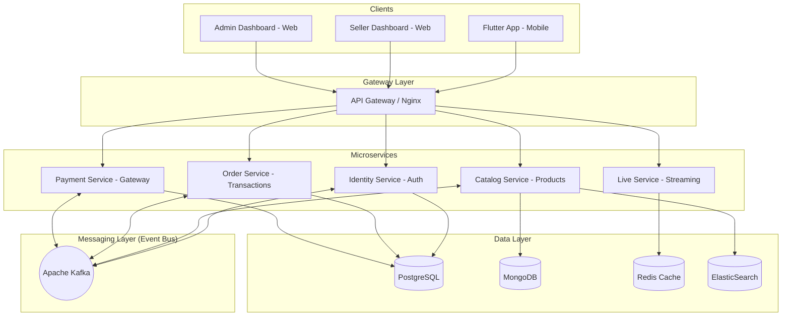

# System Overview

## 1. High-Level Architecture Diagram

## 2. Basic Data Flow
1. **Client** sends a request through the Gateway.
2. **Gateway** validates identity and routes the request to the target service.
3. **Services** communicate synchronously via gRPC or asynchronously via Kafka.
4. Financial data is stored in **PostgreSQL**, while product data resides in **MongoDB**.
5. **ElasticSearch** is updated in real-time via the event system whenever product data changes.
