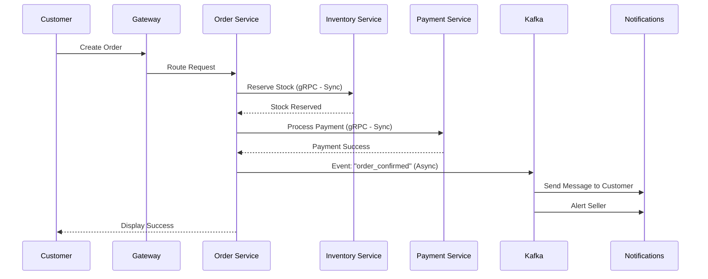

# Data Flow Diagram

This diagram illustrates how data moves between components during a purchase transaction.

```mermaid
sequenceDiagram
    participant C as Customer
    participant G as Gateway
    participant O as Order Service
    participant I as Inventory Service
    participant P as Payment Service
    participant K as Kafka
    participant N as Notifications

    C->>G: Create Order
    G->>O: Route Request
    O->>I: Reserve Stock (gRPC - Sync)
    I-->>O: Stock Reserved
    O->>P: Process Payment (gRPC - Sync)
    P-->>O: Payment Success
    O->>K: Event: "order_confirmed" (Async)
    K->>N: Send Message to Customer
    K->>N: Alert Seller
    O-->>C: Display Success
```
