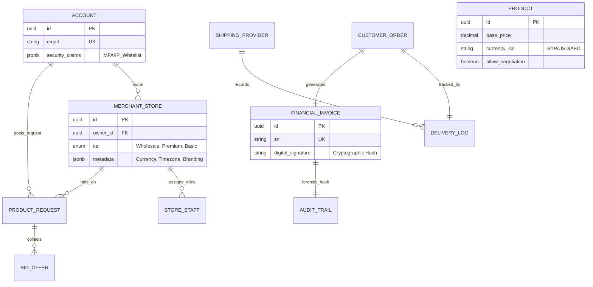

# دراسة هندسة البيانات والنمذجة المتقدمة (Advanced Data Architecture & Modeling Study)

> **ملخص الدراسة (Abstract):**  
> تُقدّم هذه الدراسة تحليلاً أنطولوجياً لهيكلية البيانات، متبنيةً منهجية **المثابرة متعددة اللغات (Polyglot Persistence)**. تهدف الدراسة لضمان "النزاهة الجنائية" للعمليات المالية والمرونة القصوى لكتالوج المنتجات والمزايدات والخصومات، مع تطبيق استراتيجيات **Multi-tenant Data Isolation**.

---

## 1. مخطط العلاقات المؤسساتي الشامل (Full Enterprise ERD)

---

## 2. استراتيجية عزل البيانات (Multi-tenancy Isolation)
*   **Logical Isolation**: استخدام `store_id` كمفتاح عزل في كافة الجداول والجداول المتقاطعة.
*   **Row-Level Security (RLS)**: تفعيل سياسات الأمان على مستوى السطر في PostgreSQL لمنع تسريب البيانات بين التجار حتى لو تم اختراق طبقة التطبيق.

---

## 3. التبرير العلمي لهندسة الـ NoSQL
يُستخدم MongoDB ليس فقط للكتالوج، بل كمخزن للـ **Read Models** منزوعة التطبيع (Denormalized) لدعم تجربة الـ Zero Cognitive Load، حيث يتم استرجاع كافة تفاصيل الصفحة في طلب (Request) واحد بدلاً من عمليات الربط (Joins) المتعددة.

---

## 4. المراجع (References)
[1] M. Fowler, *NoSQL Distilled*, 2012.  
[2] P. Sadalage, *Polyglot Persistence Patterns*, 2023.
