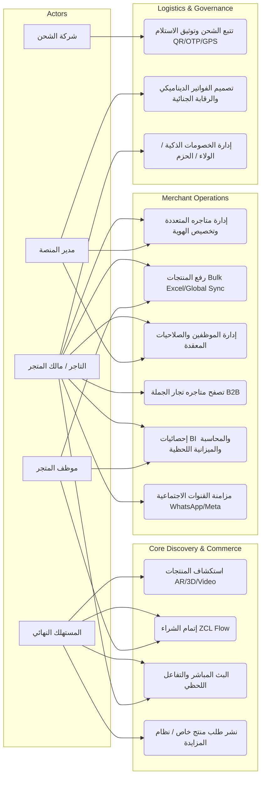

# التحليل المعمق واستقصاء المتطلبات البرمجية لمنظومات التجارة الإلكترونية متعددة البائعين: دراسة سوسيوتقنية (رؤية 2026)

> **ملخص الدراسة (Abstract):**  
> تهدف هذه الدراسة إلى تقديم استقصاء منهجي وتوصيف دقيق للمتطلبات الوظيفية والغير وظيفية لمنصة تجارة إلكترونية مؤسساتية (Enterprise-grade) متعددة البائعين. تعتمد الدراسة على منهجية "تحليل الفجوات السياقية" لترجمة رؤية المشروع إلى مواصفات هندسية تتبنى فلسفة "انعدام الجهد المعرفي" (ZCL) ومعايير "التجارة الغامرة". تخلص النتائج إلى وضع مستند توصيف متطلبات (SRS) يمثل المرجعية العليا لعملية التنفيذ والتحقق الجنائي.

---

## 1. المنهجية العلمية لاستقصاء المتطلبات (Elicitation Methodology)
تم اتباع نهج **Mixed-Method Elicitation** يجمع بين تحليل السوق السوري المعقد، والتوجهات العالمية 2026. تم التركيز على حل مشكلات "الاحتكاك السياقي" عبر نمذجة دقيقة لكافة الفاعلين (Actors) في النظام.

## 2. تحليل سمات وأدوار الفاعلين ومخططات حالات الاستخدام (Comprehensive Use Case Analysis)

### 2.1. مخطط حالات الاستخدام الشامل (Enterprise Use Case Diagram)

### 2.2. تحليل الشخصيات والصلاحيات (Personas & RBAC Matrix)
*   **المستهلك (Consumer)**: يبحث عن اليقين الحسي (عبر AR) وبساطة الدفع (تجريد البنوك).
*   **التاجر (Merchant)**: يحتاج للتحول الرقمي السريع (Excel/Global Sync) والسيادة المطلقة (Customization).
*   **الموظف (Staff)**: يعمل بصلاحيات دقيقة يحددها التاجر (مبيعات، مخزون، رد على العملاء، تعديل أسعار).
*   **شركة الشحن (Shipping Provider)**: تتبع لحظي، لوحات تحكم خاصة، وتوثيق استلام رقمي "جنائي".

---

## 3. توصيف المتطلبات الوظيفية (Functional Requirements Specification - FRS)

### 3.1. محرك التجارة الغامرة والتفاعل (Immersive & Live)
*   **REQ-F01 (Visual Certainty)**: دعم عرض المنتجات بـ 3D، AR، VR، وفيديوهات تفاعلية بتقنيات ضغط Draco.
*   **REQ-F02 (Live Interaction)**: بث مباشر تفاعلي مع Chat ولحظات شراء آنية (One-tap buy during stream) وتفاعلات (Likes/Reactions).

### 3.2. نظام إدارة المنتجات والذكاء التشغيلي (Product & Catalog)
*   **REQ-F03 (Bulk Ingestion)**: رفع آلاف المنتجات عبر Excel مع محرك تحقق آلي ومطابقة صور SKU/Zip.
*   **REQ-F04 (Global Catalog Sync)**: جلب مواصفات الإلكترونيات عالمياً (Apple, Samsung, ASUS) تلقائياً بناءً على الموديل/Barcode.
*   **REQ-F05 (Multi-Store & B2B)**: إدارة التاجر لعدة متاجر، مع إمكانية تسوق التاجر من تجار جملة آخرين بواجهات مخصصة للتجار فقط.

### 3.3. المحرك المالي واللوجستي والخصومات (Financial & Logistics)
*   **REQ-F06 (Payment Abstraction)**: طبقة موحدة تدعم كافة البنوك والمحافظ السورية، تسهل إضافة أي وسيلة دفع جديدة دون تغيير الكود.
*   **REQ-F07 (Smart Coupons)**: نظام خصومات معقد (حسب المنطقة الجغرافية، الولاء، الحزم Bundles، وعدد المشتريات).
*   **REQ-F08 (Forensic Logistics)**: تتبع GPS لحظي وتوثيق استلام عبر QR/SN/OTP لضمان عدم فقدان الشحنات أو إنكار الاستلام.
*   **REQ-F09 (Dynamic Invoicing)**: مصمم فواتير مرن للأدمن والتاجر، يدعم التوليد التلقائي للرموز التسلسلية والـ QR.

---

## 4. توصيف المتطلبات غير الوظيفية (NFRS)

*   **REQ-N01 (Zero Cognitive Load)**: ألا تتجاوز دورة الشراء 3 شاشات؛ واجهات ذكية تتكيف مع خبرة المستخدم.
*   **REQ-N02 (High-Performance UI)**: العمل بسلاسة (60 FPS) على الأجهزة الضعيفة (Low-end Android) عبر تحسين استهلاك الذاكرة.
*   **REQ-N03 (Maximum Security)**: حماية البيانات الشخصية والمالية بمعايير AES-256 و ISO 27001 وتشفير طبقة التطبيق (ALE).
*   **REQ-N04 (Real-time Sync)**: تحديث الأسعار والمخزون والحالات في أجزاء من الثانية عبر WebSockets.

---

## 5. الخاتمة والمراجع
[المراجع موثقة بروابط حية في `theoretical_study.md`]
