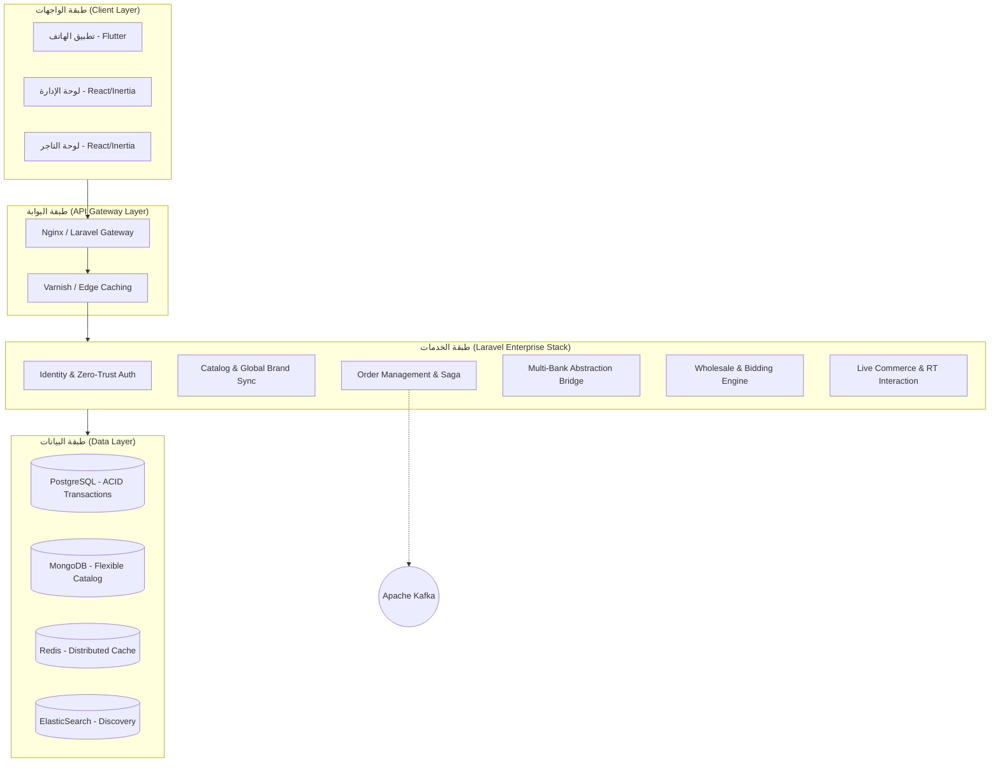
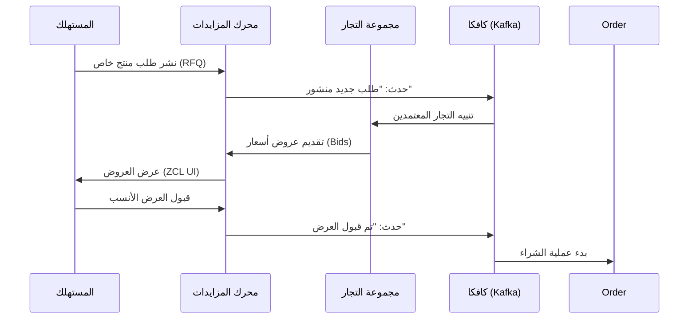

# دراسة الهندسة المعمارية وتصميم النظام المتقدم (Advanced System Architecture & Design Study)

> **ملخص الدراسة (Abstract):**  
> تقدم هذه الدراسة توصيفاً هندسياً شمولياً لبنية النظام البرمجي لمنصة التجارة الإلكترونية، متبنية نموذج **C4 Model** كإطار عمل مرجعي. ترتكز المعمارية على مبادئ **التصميم القائم على المجال (DDD)** ونمط **الخدمات المصغرة (Microservices)** المستند إلى **PHP Laravel Octane**. تهدف الهندسة المقترحة إلى تحقيق توازن أمثل بين الأداء العالي (High Performance) والمرونة التشغيلية (Resilience) والسيادة التقنية عبر معمارية **Zero Trust**.

---

## 1. الفلسفة المعمارية والأنماط الهندسية المتقدمة (Architectural Philosophy)

تم تبني منهجية **Modular Monolith-to-Microservices** لضمان الانتقال السلس، مع الالتزام بالأنماط التالية:
*   **Domain-Driven Design (DDD)**: عزل منطق الأعمال في حدود سياقية واضحة (Bounded Contexts) لمنع التداخل الهيكلي.
*   **Event-Driven Architecture (EDA)**: الاعتماد على الـ Event Bus (Apache Kafka / Redis) لتحقيق الاستجابة اللحظية وفك الارتباط بين الخدمات.
*   **Multi-tenancy Isolation**: تطبيق استراتيجية عزل البيانات للتاجر (Logical Isolation) لضمان الأمان والخصوصية لكل متجر.
*   **Service Mesh (Sidecar Pattern)**: استخدام (Istio/Linkerd) لإدارة التواصل بين الخدمات وتأمينها عبر (mTLS).

## 2. نَمذجة بنية النظام (C4 Model)

### 2.1. المستوى الثاني: مخطط الحاويات (Level 2: Container Diagram)

---

## 3. مخططات التتابع للعمليات المعقدة (Complex Sequence Modeling)

### 3.1. دورة حياة "المزايدة العكسية" في نظام الـ B2B (Reverse Bidding Flow)

---

## 4. هندسة التوفر والتعافي (High Availability & Disaster Recovery)
*   **Global Server Load Balancing (GSLB)**: لتوجيه المرور بناءً على الموقع الجغرافي.
*   **Active-Passive Replication**: لضمان عدم فقدان البيانات المالية في PostgreSQL.
*   **Health Check Probes**: مراقبة حيوية الحاويات في Kubernetes وإعادة التشغيل تلقائياً عند الفشل.

---

## 5. المراجع (References - IEEE Style)
[1] R. C. Martin, *Clean Architecture*, 2017.  
[2] C. Richardson, *Microservices Patterns*, 2018.  
[3] Laravel Octane Whitepaper, 2025.
