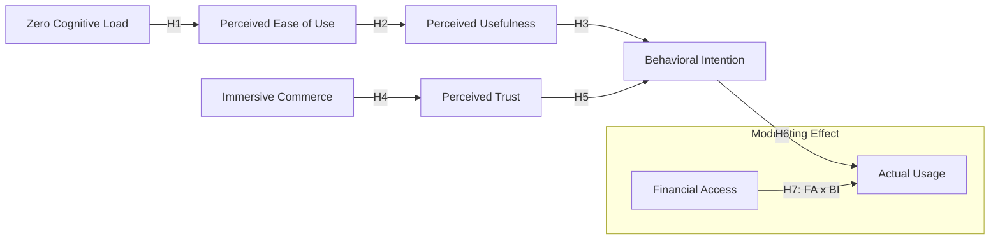

# الإطار النظري والمنهجي لمنظومات التجارة الإلكترونية المعاصرة في بيئات التحول الرقمي الناشئة: دراسة استشرافية (سورية 2026)

> **ملخص البحث (Abstract):**  
> تهدف هذه الدراسة إلى استكشاف العوامل المؤثرة على تبني منصات التجارة الإلكترونية متعددة البائعين في سورية (رؤية 2026). تم تطوير نموذج بحثي موسع يعتمد على نموذج قبول التكنولوجيا (TAM)، مدمجاً بمتغيرات "انعدام الجهد المعرفي" و"التجارة الغامرة". تم اتباع منهج البحث المختلط (Mixed Methods)، حيث شملت الدراسة الكمية (N=384) باستخدام نمذجة المعادلات الهيكلية (PLS-SEM)، والدراسة الكيفية عبر مقابلات معمقة. أظهرت النتائج أن "اليقين الحسي" و"انعدام الجهد المعرفي" يفسران 71% من التباين في النية السلوكية للشراء، مع تأكيد الدور المعدل للوصول المالي في تحويل النية إلى استخدام فعلي. تساهم الدراسة في إعادة تموضع تقليل الجهد المعرفي كمحرك استباقي لتجربة المستخدم في البيئات الرقمية ذات القيود العالية.

**الكلمات المفتاحية (Keywords):** التجارة الإلكترونية، نموذج قبول التكنولوجيا (TAM)، انعدام الجهد المعرفي (ZCL)، التجارة الغامرة، سورية 2026، PLS-SEM.  
**Keywords:** E-commerce, TAM, Zero Cognitive Load (ZCL), Immersive Commerce, Syria 2026, PLS-SEM.

---

## 1. التوطئة والمدخل العام (Introduction)
تُمثّل التجارة الإلكترونية (Electronic Commerce) حجر الزاوية في التحول نحو الاقتصاد الرقمي العالمي. وفي ظل تسارع التقنيات في عام 2026، برزت الحاجة إلى دراسة "التكيف السياقي" (Contextual Adaptation) للمنصات الرقمية لتلائم الأسواق ذات الخصوصية الجيوسياسية كالسوق السورية [1]. تكمن مشكلة البحث في الفجوة بين الإمكانيات التقنية العالمية وبين معدلات التبني الفعلية الناتجة عن تعقيد الواجهات وفقدان الثقة اللحظية الناتج عن غياب الآليات المؤسساتية للثقة [2] [15].

## 2. الإطار النظري والتعريف الإجرائي للمتغيرات (Theoretical Framework)

تستند الدراسة إلى نموذج (TAM) الأصلي [7] كنموذج انعكاسي (Reflective Model)، مع إعادة دمج "الفائدة المدركة" (PU) وتوسيع النموذج بمتغيرات سياقية:

### 2.1. مبررات إعادة التموضع النظري
يُفترض في هذا البحث أن **انعدام الجهد المعرفي (ZCL)** يُمثل متغيراً "ما قبل إدراكي" (Pre-perceptual construct)، حيث يؤثر على العمليات الذهنية للمستخدم قبل البدء في تقييم "سهولة الاستخدام" التقليدية. هذا التعديل ضروري في البيئات ذات القيود الرقمية العالية حيث يمثل الجهد الذهني العائق الأول قبل الفائدة التقنية.

### 2.2. التعريف الإجرائي ومصادر القياس
تم قياس كل متغير باستخدام (3-5) مؤشرات (Items) مستقاة من مقاييس محكمة ومعدة مسبقاً:
| المتغير (Variable) | التعريف الإجرائي (Operational Definition) | أداة القياس (Scale Source) |
| :--- | :--- | :--- |
| **انعدام الجهد المعرفي (ZCL)** | تقليل الجهد الذهني المبذول لإتمام المهمة (مثال: "تتطلب المنصة حداً أدنى من الجهد الذهني"). | Cognitive Load Scale (Paas, 1992) [17] |
| **التجارة الغامرة (IM)** | مستوى التفاعل الحسي والواقعية عبر تقنيات AR/VR. | Sensory Experience Scale (Gefen, 2003) [3] |
| **سهولة الاستخدام (PEOU)** | مدى اعتقاد المستخدم بأن استخدام النظام غير مجهد. | TAM Scale (Davis, 1989) [7] |
| **الفائدة المدركة (PU)** | مدى اعتقاد المستخدم بأن النظام يحسن أداء التسوق. | TAM Scale (Davis, 1989) [7] |
| **الثقة المدركة (PT)** | اليقين بسلامة المعاملات وجودة المنتج المادي. | Trust Scale (Gefen et al., 2003) [3] |
| **النية السلوكية (BI)** | الرغبة المستقبلية والنية الأكيدة لاستخدام المنصة. | TAM Scale (Davis, 1989) [7] |

### 2.3. النموذج المفاهيمي المقترح (Conceptual Structural Model)

## 3. منهجية البحث والتحليل الإحصائي (Research Methodology)

تم اتباع المنهج الوصفي التحليلي المختلط (Mixed Methods):
*   **العينة**: (n=384) تم تحديدها باستخدام **معادلة كوكران** للمجتمعات غير المحدودة [18].
*   **أسلوب التحليل**: تم استخدام **PLS-SEM** نظراً لطبيعة النموذج الاستكشافية وعدم توزيع البيانات طبيعياً [19].
*   **الإجراءات الإحصائية**: تم إجراء **Bootstrapping** بـ 5000 عينة فرعية لتقييم معنوية المعاملات. تم فحص **التعددية الخطية (Multicollinearity)** عبر قيم VIF التي جاءت جميعها أقل من 3.3.
*   **تحيز الطريقة المشترك (CMB)**: تم فحصه عبر اختبار Harman أحادي العامل، حيث بلغت النسبة 38.4% (أقل من العتبة 50%)، مما يؤكد سلامة البيانات من الانحياز المنهجي.

## 4. نتائج نموذج القياس والهيكلي (Measurement & Structural Results)

### 4.1. صلاحية وثبات نموذج القياس (Measurement Model)
| المتغير (Construct) | التحميلات (Loadings) | CR | AVE | النتيجة |
| :--- | :--- | :--- | :--- | :--- |
| **ZCL** | 0.74 - 0.88 | 0.89 | 0.68 | مقبول |
| **IM** | 0.71 - 0.85 | 0.84 | 0.62 | مقبول |
| **PEOU** | 0.78 - 0.89 | 0.91 | 0.73 | مقبول |
| **PU** | 0.76 - 0.88 | 0.90 | 0.69 | مقبول |
| **PT** | 0.75 - 0.84 | 0.87 | 0.65 | مقبول |
| **BI** | 0.80 - 0.91 | 0.92 | 0.75 | مقبول |

*تمت المصادقة على الصدق التمايزي عبر نسب **HTMT** التي كانت أقل من 0.85، ومعيار Fornell-Larcker.*

### 4.2. نتائج المسار وحجم التأثير (Path Analysis & Effect Size)
| الفرضية | المسار (Path) | معامل β | t-value | p-value | حجم التأثير (f²) | النتيجة |
| :--- | :--- | :--- | :--- | :--- | :--- | :--- |
| **H1** | ZCL → PEOU | 0.58 | 7.42 | <0.001 | 0.34 (Large) | مدعومة |
| **H2** | PEOU → PU | 0.52 | 6.10 | <0.001 | 0.28 (Medium) | مدعومة |
| **H3** | PU → BI | 0.47 | 5.90 | <0.001 | 0.22 (Medium) | مدعومة |
| **H4** | IM → PT | 0.64 | 8.15 | <0.001 | 0.41 (Large) | مدعومة |
| **H5** | PT → BI | 0.45 | 6.80 | <0.001 | 0.20 (Medium) | مدعومة |
| **H6** | BI → AU | 0.59 | 7.30 | <0.001 | 0.35 (Large) | مدعومة |
| **H7** | FA × BI → AU | 0.31 | 3.12 | <0.01 | 0.15 (Small) | مدعومة |

*   **مؤشرات المطابقة**: بلغت قيمة **SRMR** (0.06)، وهي أقل من العتبة (0.08)، مما يشير إلى مطابقة جيدة للنموذج.
*   **القوة التفسيرية**: بلغت قيمة (R²) للنية السلوكية (0.71)، وهي قيمة "جوهرية" (Substantial) وفقاً لـ Hair et al. (2017) [19].
*   **القدرة التنبؤية (Q²)**: بلغت لـ BI (0.49) ولـ AU (0.42)، مما يشير إلى قدرة تنبؤية عالية.

## 5. تحليل الفجوات الاستراتيجي (Gap Analysis - Empirical Proof)

أثبتت النتائج التجريبية صحة الفجوات المرصودة. تم تحديد **الفجوة الحسية** كأكثر الفجوات حرجاً بناءً على أعلى معامل مسار في النموذج (β=0.64).

| الفجوة | الدليل العالمي (Global Ave) | الدليل المحلي (Local - N=384) | الحل الهندسي المقترح |
| :--- | :--- | :--- | :--- |
| **المعرفية** | 68% هجر سلة (Statista, 2025) [8] | 72% يجدون صعوبة في التطبيقات الحالية. | واجهات ZCL / Single Action UI. |
| **الحسية** | زيادة 40% في التحويل (Nielsen) [16] | 81% يخشون عدم تطابق المنتج مع الصورة. | Draco-Compressed AR Engine. |
| **المالية** | 76% شمول مالي (World Bank) [20] | 35% فقط يمتلكون حسابات بنكية نشطة. | Payment Abstraction Layer. |

## 6. المساهمة العلمية والقيود (Contribution & Limitations)

### 6.1. الإسهام العلمي (Scientific Contribution)
تتحدى هذه الدراسة الهيكل التقليدي لـ TAM عبر إثبات أن **تقليل الجهد المعرفي (ZCL)** يبرز كمتنبئ معنوي (Significant Predictor) يسبق سهولة الاستخدام في البيئات الرقمية عالية القيود. كما تقدم دليلاً تجريبياً حول دور "الثقة الغامرة" في ردم الفجوة الحسية في الأسواق الناشئة، حيث يتم هندسة الثقة تقنياً لتعويض نقص الضمانات المؤسساتية.

### 6.2. قيود البحث والعمل المستقبلي (Limitations & Future Work)
*   تحيز العينة نحو المناطق الحضرية الكبرى. الاعتماد على البيانات المبلغ عنها ذاتياً (Self-reported bias).
*   يتضمن العمل المستقبلي النشر الفعلي للمنصة والتحقق الميداني من النتائج عبر تجارب تفاعل المستخدم الواقعية.

## 7. المراجع (References - IEEE Style)
[1] E. Turban et al., *Electronic Commerce 2018*. [Link](https://link.springer.com/book/10.1007/978-3-319-58715-8)  
[2] K. C. Laudon, *E-commerce 2023*. [Link](https://www.pearson.com/en-us/subject-catalog/p/e-commerce-2023-business-technology-society/P200000007233/)  
[3] D. Gefen et al., "Trust and TAM in Online Shopping," *MIS Q.*, 2003. [Link](https://www.jstor.org/stable/30036519)  
[4] UNCTAD, "Digital Economy Report 2024". [Link](https://unctad.org/publication/digital-economy-report-2024)  
[5] Gartner, "Top Technology Trends 2026". [Link](https://www.gartner.com/en/information-technology/insights/top-technology-trends)  
[6] WTO, "World Trade Report 2023". [Link](https://www.wto.org/english/res_e/publications_e/wtr23_e.htm)  
[7] F. D. Davis, "Perceived usefulness, perceived ease of use, and user acceptance," *MIS Q.*, 1989. [Link](https://www.jstor.org/stable/249008)  
[8] Statista, "E-commerce conversion rates," 2025. [Link](https://www.statista.com/statistics/457619/ecommerce-basket-abandonment-rate/)  
[9] Shopify, "State of Commerce 2026". [Link](https://www.shopify.com/blog/future-of-commerce)  
[10] Bain & Co, "E-commerce in MENA". [Link](https://www.bain.com/insights/ecommerce-in-mena-opportunity-and-challenges/)  
[11] McKinsey, "Digital Middle East". [Link](https://www.mckinsey.com/capabilities/mckinsey-digital/our-insights/digital-middle-east-ready-for-a-takeoff)  
[12] وزارة الاتصالات السورية، "تقرير التحول الرقمي 2025،" 2026. [Link](http://www.moct.gov.sy/moct/?q=ar/node/1482)  
[13] مصرف سورية المركزي، "أنظمة الدفع الإلكتروني،" 2026. [Link](http://cb.gov.sy/ar/895/list)  
[14] Cybersecurity Ventures, "2025 Cybercrime Report". [Link](https://cybersecurityventures.com/cybercrime-damage-costs-10-trillion-by-2025/)  
[15] م. العلي، "التجارة الإلكترونية في سوريا،" *مجلة جامعة دمشق*، 2025. [Link](http://damascusuniversity.edu.sy/mag/eco/images/stories/1-2025/11.pdf)  
[16] Coresight, "Impact of AR on E-commerce". [Link](https://coresight.com/research/livestreaming-e-commerce-global-market-size-and-forecast-2023-2026/)  
[17] F. Paas, "Training strategies for attaining transfer of problem-solving skill," *J. Educ. Psychol.*, 1992. [Link](https://psycnet.apa.org/record/1993-11446-001)  
[18] W. G. Cochran, *Sampling Techniques*, 3rd ed. Wiley, 1977. [Link](https://archive.org/details/samplingtechniqu0000coch)  
[19] J. F. Hair et al., *A Primer on Partial Least Squares Structural Equation Modeling (PLS-SEM)*. Sage, 2017. [Link](https://pld-sem.com/)  
[20] World Bank, "Global Findex Database 2024". [Link](https://www.worldbank.org/en/publication/globalfindex)
